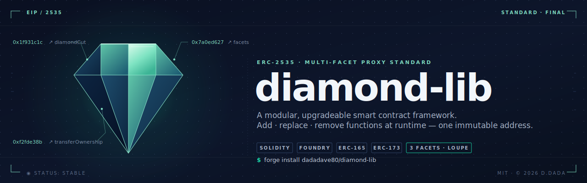

---

> [!WARNING]
> **Pending Security Audits**
> This library is currently under active development and security review. **Do not use in production** until formal security audits are completed.

---

A production-grade, modular smart contract framework built on the [EIP-2535 Diamond Standard](https://eips.ethereum.org/EIPS/eip-2535). This library provides a battle-tested foundation for building composable, upgradeable, and gas-efficient smart contracts using facet-based architecture.

---

## 📚 Documentation

| Document | Purpose |
|----------|---------|
| **[SPECIFICATION.md](./SPECIFICATION.md)** | Complete architecture, storage layout, and design decisions |
| **[DEVELOPER_GUIDE.md](./DEVELOPER_GUIDE.md)** | Practical examples for common tasks and patterns |
| **[GLOSSARY.md](./GLOSSARY.md)** | Terminology reference and core concepts |
| **[SECURITY.md](./SECURITY.md)** | Security policies and vulnerability reporting |
| **[CONTRIBUTING.md](./CONTRIBUTING.md)** | Guidelines for contributing to the project |

---

## 🎯 Overview

The Diamond pattern enables upgradeable smart contracts through **facets**—modular contracts that share storage while maintaining independent logic and upgradeable implementations.

### ✨ Key Features

- ⚙️ **Modular Facets**: Organize functionality into focused, independent modules
- 🔁 **Runtime Upgrades**: Add, replace, or remove functions without contract migration
- 🔍 **Introspection**: Built-in loupe functions to query Diamond composition
- 👑 **Ownership Control**: EIP-173 compatible single-owner access control
- 📚 **ERC165 Support**: Standardized interface detection
- 🧪 **Comprehensive Tests**: Foundry-based test suite with mutation testing
- 🚀 **Deployment Scripts**: Ready-to-use initialization and deployment tooling

---

## 🛠️ Project Structure

```
src/
├── Diamond.sol                 # Core Diamond proxy contract
├── facets/
│   ├── DiamondCutFacet.sol    # Modify Diamond structure
│   ├── DiamondLoupeFacet.sol  # Introspect Diamond composition
│   ├── OwnableFacet.sol       # Ownership management
│   └── ERC165Facet.sol        # Interface registration
├── initializer/
│   ├── DiamondInit.sol        # Initial setup contract
│   └── MultiInit.sol          # Multi-step initialization
├── interfaces/
│   ├── IDiamondCut.sol        # Diamond cut standard
│   ├── IDiamondLoupe.sol      # Loupe functions standard
│   └── IERC165.sol            # Interface detection
├── libraries/
│   ├── DiamondLib.sol         # Core Diamond logic
│   ├── OwnableLib.sol         # Ownership primitives
│   ├── InitializableLib.sol   # Initialization guards
│   └── ERC165Lib.sol          # Interface registration
└── script/
    └── DeployDiamond.s.sol    # Foundry deployment script

test/
├── DiamondTest.t.sol          # Core Diamond tests
└── helpers/                   # Reusable test fixtures
```

---

## 🚀 Quick Start

### 1. Install the Library

```sh
forge install dadadave80/diamond-lib
```

### 2. Import Diamond Components

```solidity
import {Diamond} from "@diamond/Diamond.sol";
import {DiamondCutFacet} from "@diamond/facets/DiamondCutFacet.sol";
import {DiamondLoupeFacet} from "@diamond/facets/DiamondLoupeFacet.sol";
import {OwnableFacet} from "@diamond/facets/OwnableFacet.sol";
import {DiamondInit} from "@diamond/initializer/DiamondInit.sol";
```

### 3. Deploy and Initialize

```sh
forge script script/DeployDiamond.s.sol:DeployDiamond \
  --rpc-url <RPC_URL> \
  --private-key <PRIVATE_KEY> \
  --broadcast
```

### 4. Run Tests

```sh
forge test -v
```

---

## 📖 Common Tasks

### Create a Custom Facet

See [DEVELOPER_GUIDE.md](./DEVELOPER_GUIDE.md#task-1-create-a-custom-facet) for detailed instructions.

### Add a Facet to Diamond

See [DEVELOPER_GUIDE.md](./DEVELOPER_GUIDE.md#task-2-add-a-custom-facet-to-diamond) for complete example.

### Verify Diamond Composition

Use the built-in loupe functions:

```solidity
IDiamondLoupe loupe = IDiamondLoupe(diamond);
Facet[] memory facets = loupe.facets();
address facetAddr = loupe.facetAddress(selector);
```

See [GLOSSARY.md](./GLOSSARY.md#loupe) for more on introspection.

---

## 🧩 Core Facets

| Facet | Purpose | Reference |
|-------|---------|-----------|
| **DiamondCutFacet** | Execute diamond cuts (add/replace/remove functions) | [Spec](./SPECIFICATION.md#diamond-cut-operation) |
| **DiamondLoupeFacet** | Query Diamond composition | [Spec](./SPECIFICATION.md#loupe-functions) |
| **OwnableFacet** | Manage Diamond ownership (EIP-173) | [Spec](./SPECIFICATION.md#ownership--access-control) |
| **ERC165Facet** | Register supported interfaces | [Spec](./SPECIFICATION.md#erc165-interface-support) |

---

## 🔐 Storage & Architecture

The library uses **ERC-7201 namespaced storage** to prevent collisions between facets:

```solidity
// Each component gets isolated storage
bytes32 constant STORAGE_LOCATION = 
  uint256(keccak256(abi.encode(uint256(keccak256("namespace")) - 1))) 
  & ~bytes32(uint256(0xff));
```

**Learn more:**
- [SPECIFICATION.md](./SPECIFICATION.md#storage-layout) — Storage architecture
- [DEVELOPER_GUIDE.md](./DEVELOPER_GUIDE.md#storage-management) — Using storage in custom facets

---

## 🔄 Upgrade Workflow

1. **Design** new facet or changes
2. **Test** on local fork: `forge test --fork-url <RPC_URL>`
3. **Deploy** new facet: `forge create --rpc-url <RPC_URL> ...`
4. **Cut** facet into Diamond: Call `diamondCut()` with cuts array
5. **Verify** with loupe functions
6. **Monitor** DiamondCut event for audit trail

See [DEVELOPER_GUIDE.md](./DEVELOPER_GUIDE.md#common-tasks) for practical examples.

---

## 📋 Standards Compliance

This library implements and supports:

- **[EIP-2535](https://eips.ethereum.org/EIPS/eip-2535)** — Diamond Standard
- **[ERC-7201](https://eips.ethereum.org/EIPS/eip-7201)** — Namespaced Storage Layout
- **[EIP-165](https://eips.ethereum.org/EIPS/eip-165)** — Interface Detection
- **[EIP-173](https://eips.ethereum.org/EIPS/eip-173)** — Ownership Standard

---

## 🤝 Contributing

We welcome contributions! Please see [CONTRIBUTING.md](./CONTRIBUTING.md) for guidelines.

### Security

Please report security vulnerabilities privately. See [SECURITY.md](./SECURITY.md) for details.

---

## 📚 Learning Resources

- **New to Diamond?** Start with [GLOSSARY.md](./GLOSSARY.md#core-concepts)
- **Building a facet?** See [DEVELOPER_GUIDE.md](./DEVELOPER_GUIDE.md#common-tasks)
- **Deep dive?** Read [SPECIFICATION.md](./SPECIFICATION.md)
- **Official EIP:** [EIP-2535 Diamond Standard](https://eips.ethereum.org/EIPS/eip-2535)
- **Community:** [Nick Mudge's Awesome Diamonds](https://github.com/mudgen/awesome-diamonds)

---

## 📄 License

MIT © 2025  
Built with ♥ by David Dada

---

**[⬆ back to top](#-diamond-library)**
