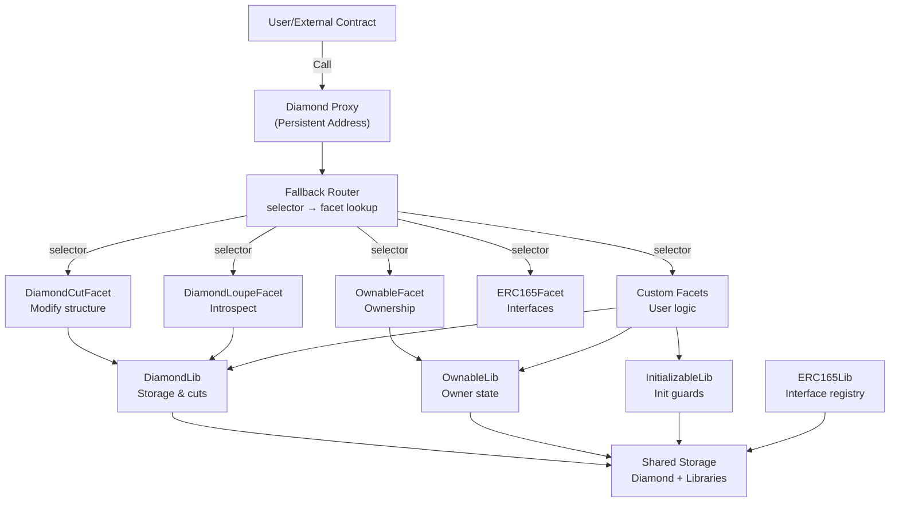
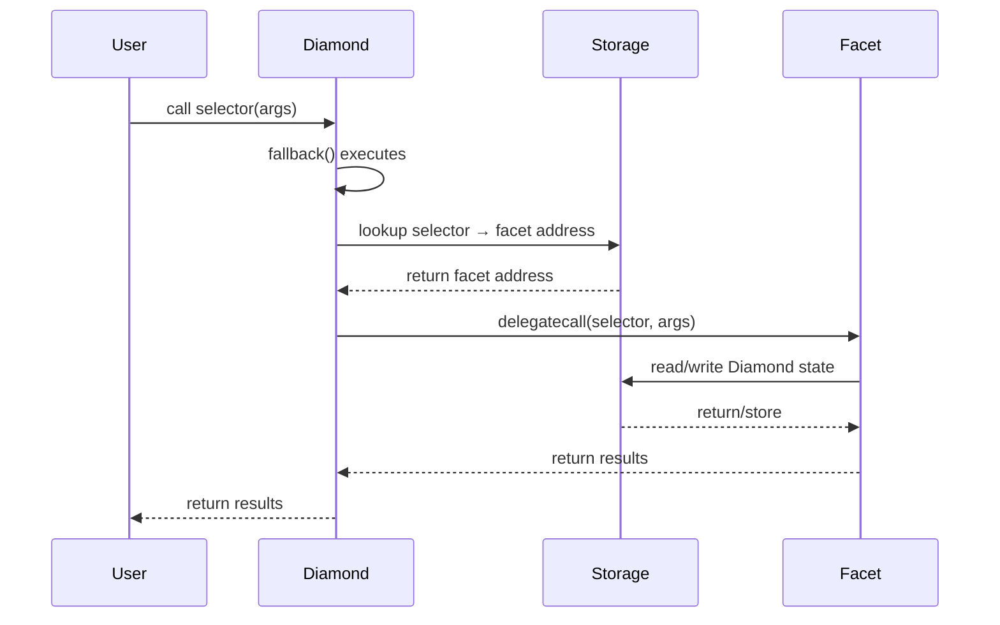
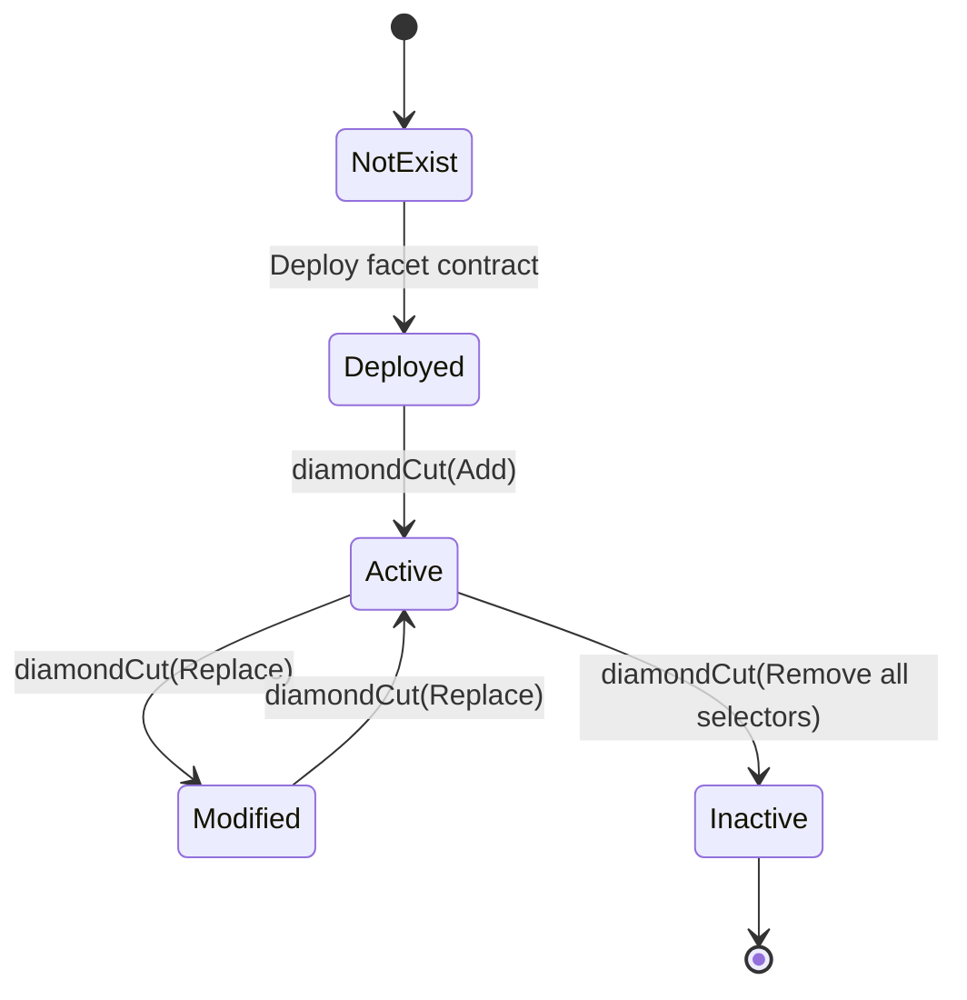
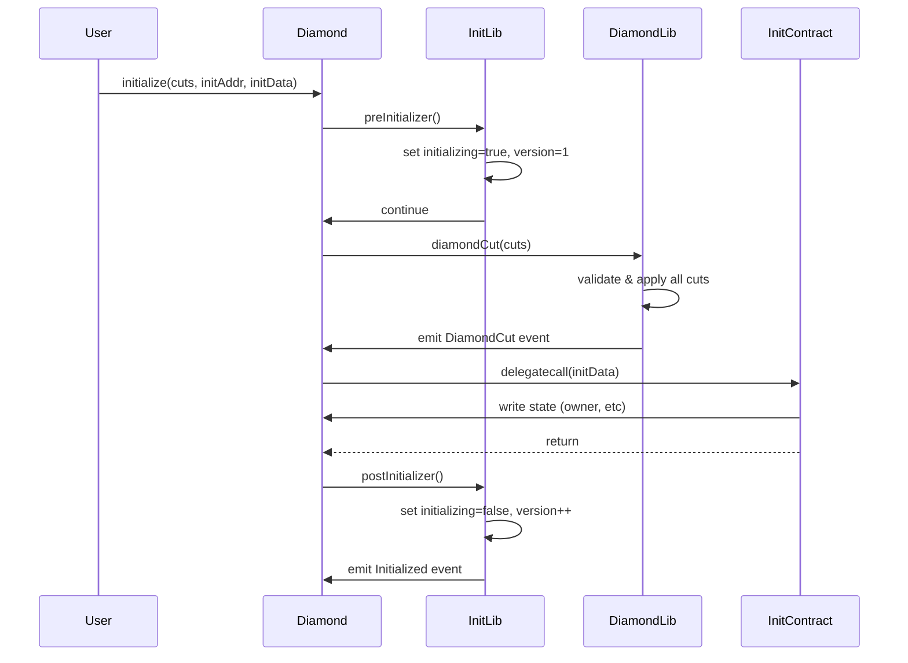
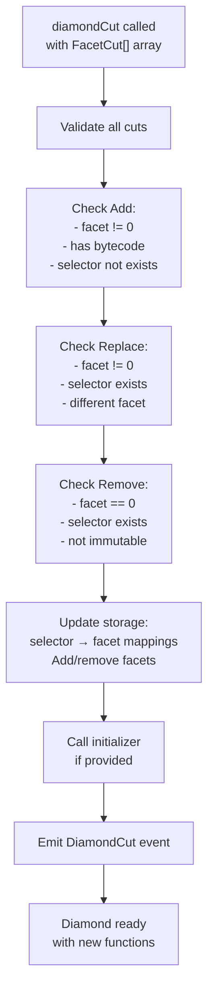
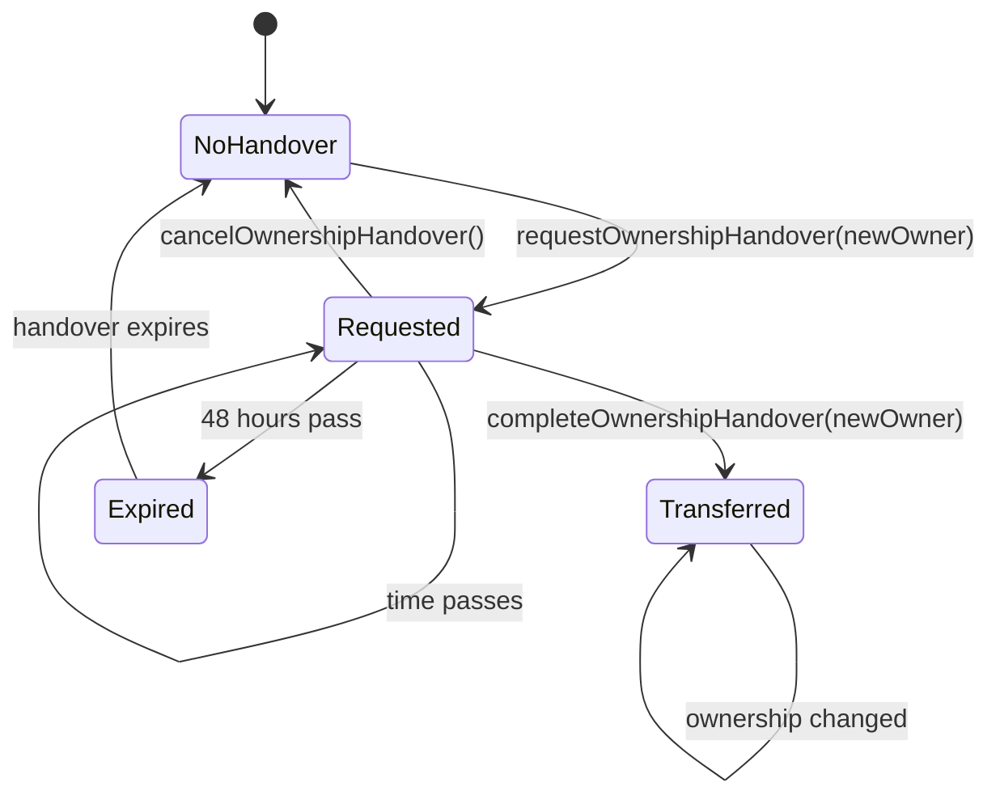

# Diamond Library Specification

**Version**: 1.0  
**Framework**: ERC-2535 Diamond Standard  
**Solidity**: ^0.8.20  
**Last Updated**: April 2026

---

## Table of Contents

1. [Architecture Overview](#architecture-overview)
2. [Core Concepts](#core-concepts)
3. [Storage Layout](#storage-layout)
4. [Initialization Pattern](#initialization-pattern)
5. [Diamond Cut Operation](#diamond-cut-operation)
6. [Ownership & Access Control](#ownership--access-control)
7. [Extension Guide](#extension-guide)
8. [Security Assumptions](#security-assumptions)
9. [Design Decisions](#design-decisions)

---

## Architecture Overview

### High-Level Component Diagram



### Fallback Delegation Flow



### Facet Lifecycle State Machine



---

## Core Concepts

### Function Selector

A **function selector** is the first 4 bytes of a function's signature hash.

```solidity
bytes4 selector = bytes4(keccak256("transfer(address,uint256)"));
// Result: 0xa9059cbb
```

**Why selectors matter:**
- Compact representation (4 bytes vs full signature)
- Gas-efficient lookup in calldata
- EVM native: handled by fallback routing
- Enables function replacement without bytecode changes
- Uniquely identifies a function within the Diamond

### Facet

A **facet** is a separate contract containing related functions that execute in the Diamond's storage context.

**Critical property**: All code executes in Diamond's storage via `delegatecall`, not in the facet's storage.

```solidity
// Facet code
function doSomething() external {
    // msg.sender = original caller
    // this = Diamond address
    // Storage = Diamond's storage (not facet's)
}
```

**When to create a facet:**
- Group related functions (e.g., all token functions)
- Manage bytecode size (55KB Ethereum limit)
- Separate concerns (governance, tokens, markets)
- Enable independent upgrades of functionality

### Diamond Cut

A **diamond cut** is an atomic transaction that modifies which functions the Diamond exposes.

**Three operations:**

| Operation | Purpose | Constraints |
|-----------|---------|-------------|
| **Add** | Introduce new functions | Selector must not exist, facet must have bytecode |
| **Replace** | Change function implementation | Selector must exist, different facet required |
| **Remove** | Delete function | Facet address must be zero |

**Atomicity guarantee**: All operations execute together; if any fails, entire cut reverts.

### Loupe Functions

**Loupe** (jeweler's inspection tool) provides read-only introspection into Diamond composition.

```solidity
function facets() external view returns (Facet[] memory);
function facetFunctionSelectors(address facet) external view returns (bytes4[] memory);
function facetAddresses() external view returns (address[] memory);
function facetAddress(bytes4 selector) external view returns (address);
```

**Use cases:**
- Verify upgrades were applied correctly
- Determine which facet implements a selector
- Monitor available functionality
- Audit Diamond composition history (with events)

### Initialization Pattern

Initialization differs from constructors because Diamond is a proxy:

**Why not use constructor:**
- Constructor runs when facet is deployed, not Diamond
- `msg.sender` = facet deployer, not Diamond creator
- State goes to facet storage, not Diamond storage

**Solution: Delegatecall-based initialization:**

```solidity
// Initialize during Diamond deployment
Diamond.initialize(
    [facetCuts...],
    address(diamondInit),
    abi.encodeCall(DiamondInit.init, ())
);
```

Functions run in Diamond's delegatecall context, so initialization happens in the right storage.

---

## Storage Layout

### ERC-7201 Namespaced Storage

This library uses ERC-7201 to prevent storage collisions between components.

**Why ERC-7201:**
- Each component gets isolated namespace
- Storage location is deterministically computable
- Future-proof for composability
- Prevents accidental overwrites

**Formula:**
```solidity
uint256 slot = uint256(keccak256(abi.encode(uint256(keccak256("namespace")) - 1))) & ~bytes32(uint256(0xff));
```

### Diamond Storage Location

**Namespace**: `"diamond.lib.storage"`  
**Location**: `0x6d5a93fec60e12d72b781fe97b2b5406e385b9eaa23d3ec2fbfa067f9d0dc000`

```solidity
struct DiamondStorage {
    mapping(bytes4 selector => FacetAddressAndPosition) selectorToFacetAndPosition;
    mapping(address facet => FacetFunctionSelectorsAndPosition) facetToSelectorsAndPosition;
    address[] facetAddresses;
}

struct FacetAddressAndPosition {
    address facetAddress;
    uint96 functionSelectorPosition;
}

struct FacetFunctionSelectorsAndPosition {
    bytes4[] functionSelectors;
    uint256 facetAddressPosition;
}
```

**Design rationale:**
- `selectorToFacetAndPosition`: O(1) selector → facet lookup (essential for fallback)
- `facetToSelectorsAndPosition`: Enables facet removal without linear scan
- `facetAddresses`: Lists all facets for loupe functions
- `uint96` positions: Sufficient for array indices, saves storage space

### Owner Storage Location

**Namespace**: Owner state (internal to OwnableLib)  
**Location**: `0xffffffffffffffffffffffffffffffffffffffffffffffffffffffff74873927`

```
Single 32-byte slot:
  Bits 0-159:   Owner address (20 bytes, padded)
  Bit 255:      Flag (1 if owner is zero address)
```

**Why single slot:**
- Minimal gas overhead (single SLOAD per check)
- Atomic state transitions (single SSTORE)
- Storage efficiency

### Initialization Storage Location

**Namespace**: Initialization state  
**Location**: `0xffffffffffffffffffffffffffffffffffffffffffffffffffffffffbf601132`

```
Bit-packed single slot:
  Bit 0:        initializing flag (1 = currently initializing)
  Bits 1-64:    initialized version number
```

**Example values:**
- `0x0` = never initialized
- `0x3` = initializing version 1 (bits: 1 | (1<<1))
- `0x2` = initialized v1, not initializing

**Why bit packing:**
- Two values in one storage slot
- Atomic updates (single SSTORE)
- Fast assembly checks

### ERC165 Interface Support

**Namespace**: `"diamond.lib.storage.ERC165"`  
**Location**: `0x9ca7f3e2e2bfb15fdf072b85dde92837cddacee6cf2f6b38cd06c9457c1c4200`

```solidity
struct ERC165Storage {
    mapping(bytes4 interfaceId => bool supported) supportedInterfaces;
}
```

**Registered interfaces:**
- `0x01ffc9a7` = ERC165
- `0x7f5828d0` = ERC173 (ownership)
- `0x1f931c1c` = IDiamondCut
- `0x48e2b093` = IDiamondLoupe

---

## Initialization Pattern

### Initialization Sequence



### Reinitialization Prevention

**Problem**: Without guards, anyone could reset state by calling init again.

**Solution: Version tracking**

```
First init:    version 0 → 1 (success)
Retry same:    version 1 → 1 (fails: InvalidInitialization)
Upgrade init:  version 1 → 2 (success: reinitializer)
```

**Guarantees:**
- Cannot reinitialize to same or lower version
- Can upgrade to higher version (supports versioned upgrades)
- Initialization flag prevents reentrancy during init

### MultiInit for Complex Setup

For multiple sequential initializers:

```solidity
MultiInit.multiInit(
    [address(init1), address(init2), address(init3)],
    [data1, data2, data3]
);
```

**Behavior:**
- Each initializer runs sequentially in Diamond's context
- Stops on zero address (allows variable-length arrays)
- Any failure reverts entire transaction
- Atomic: all succeed or none

---

## Diamond Cut Operation

### Cut Operation Validation & Execution Flow



### Example: Adding a Function

```
Input:
  selector: 0x12345678
  facet: NewFacet
  action: Add

Before:
  selectorToFacet: {0xaaaa → FacetA}
  facetAddresses: [FacetA]

Validation:
  NewFacet != 0x0 ✓
  NewFacet has bytecode ✓
  0x12345678 not in use ✓

Update Storage:
  Add NewFacet to facetAddresses
  Map 0x12345678 → NewFacet
  Track selector position in NewFacet

After:
  selectorToFacet: {0xaaaa → FacetA, 0x12345678 → NewFacet}
  facetAddresses: [FacetA, NewFacet]
  
Result: Future calls to 0x12345678 route to NewFacet
```

---

## Ownership & Access Control

### Single Owner Model

The library implements single-owner access control (EIP-173 compatible).

**Owner capabilities:**
- Execute `diamondCut()` to modify facets
- Call any function in Diamond through facets
- Transfer ownership (2-step process)

**Limitations:**
- No role-based access control
- No delegation
- No time delays/timelocks
- Single point of failure

### Two-Step Ownership Handover

**Why two-step:**
- Prevents accidental transfer to wrong address
- New owner can verify they have access
- Time window for cancellation
- Follows industry best practices



**Time limits:**
- Valid for 48 hours after request
- Automatically expires after 48 hours
- Can be cancelled before expiry

---

## Extension Guide

### Creating a Custom Facet

```solidity
// 1. Import required libraries
import {DiamondLib} from "@diamond/libraries/DiamondLib.sol";
import {OwnableLib} from "@diamond/libraries/OwnableLib.sol";

// 2. Create facet contract
contract MyCustomFacet {
    
    // 3. Implement access control
    modifier onlyOwner() {
        OwnableLib.checkOwner();
        _;
    }
    
    // 4. Implement your functions
    function myFunction(uint256 value) external onlyOwner {
        // Your logic here
        // msg.sender = original caller
        // this = Diamond address
        // Storage = Diamond's storage
    }
}

// 5. Prepare for diamond cut
bytes4[] memory selectors = new bytes4[](1);
selectors[0] = bytes4(keccak256("myFunction(uint256)"));

// 6. Create cut array
FacetCut[] memory cuts = new FacetCut[](1);
cuts[0] = FacetCut({
    facetAddress: address(myCustomFacet),
    action: FacetCutAction.Add,
    functionSelectors: selectors
});

// 7. Execute cut (owner only)
diamondCut(cuts, address(0), "");
```

### Adding Custom Storage

Use ERC-7201 to avoid conflicts:

```solidity
// MyStorage.sol - Define isolated namespace
library MyStorage {
    // Compute: keccak256(abi.encode(uint256(keccak256("my.storage")) - 1)) & ~bytes32(uint256(0xff))
    bytes32 constant STORAGE_LOCATION = 0x...;
    
    struct MyData {
        uint256 counter;
        mapping(address => uint256) balances;
    }
    
    function getStorage() internal pure returns (MyData storage s) {
        assembly {
            s.slot := STORAGE_LOCATION
        }
    }
}

// MyFacet.sol - Use storage library
contract MyFacet {
    function increment() external {
        MyStorage.getStorage().counter++;
    }
}
```

### Replacing a Facet

```solidity
// Deploy improved version
contract ImprovedMyFacet {
    // Enhanced implementation with bug fixes
}

// Propose replacement
FacetCut[] memory cuts = new FacetCut[](1);
cuts[0] = FacetCut({
    facetAddress: address(improvedMyFacet),
    action: FacetCutAction.Replace,
    functionSelectors: selectors  // Same selectors, new code
});

diamondCut(cuts, address(0), "");
```

### Removing a Facet

```solidity
FacetCut[] memory cuts = new FacetCut[](1);
cuts[0] = FacetCut({
    facetAddress: address(0),  // Must be zero for removal
    action: FacetCutAction.Remove,
    functionSelectors: selectorsToRemove
});

diamondCut(cuts, address(0), "");
```

---

## Security Assumptions

### Trust Model

| Component | Trust Level | Assumption |
|-----------|-------------|-----------|
| Owner | HIGH | Trusted to act in Diamond's interest |
| Facet code | HIGH | Audited before adding to Diamond |
| Function selectors | MEDIUM | Caller provides correct selectors |
| Delegatecall targets | HIGH | Must not create loops back to Diamond |
| Custom storage | MEDIUM | Must use ERC-7201 to avoid conflicts |

### Guarantees

1. **Selector uniqueness**: No duplicate active selectors
2. **Facet persistence**: Facets remain deployed unless explicitly removed
3. **Initialization atomicity**: All-or-nothing initialization
4. **Reentry prevention**: Initialization guards prevent accidental reentrancy
5. **Storage isolation**: ERC-7201 prevents component collisions

### Operational Security Checklist

- [ ] Test all diamond cuts in staging before production
- [ ] Audit facet code before adding to Diamond
- [ ] Plan ownership strategy (consider decentralized upgrades)
- [ ] Monitor DiamondCut and Initialization events
- [ ] Document selector → function mapping
- [ ] Verify facet bytecode before cuts
- [ ] Test storage layout doesn't conflict
- [ ] Plan for owner key management

---

## Design Decisions

### Why Assembly for Low-Level Operations

**Decision**: Use assembly for storage access, delegatecall, events

**Rationale**:
- Gas efficiency: Eliminates Solidity wrapper overhead
- Direct control: Precise operation ordering
- Library scope: Low-level patterns benefit most from optimization

**Safety**: All marked `memory-safe` and follow standard patterns.

### Why ERC-7201 Storage

**Decision**: Namespaced storage instead of inheritance

**Rationale**:
- Composable: Facets coexist without inheritance chains
- Transparent: Anyone computes storage locations
- Future-proof: New facets won't corrupt existing state
- Isolated: Each component has private namespace

### Why Single Owner

**Decision**: Only owner-based access control in core

**Rationale**:
- Minimal: Keeps library focused and auditable
- Flexible: Applications add roles via facets
- Simple: Single point of authorization
- Auditable: Easier to verify security

### Why Two-Step Handover

**Decision**: Require request → complete steps for ownership transfer

**Rationale**:
- Safety: Prevents accidental loss
- Verification: New owner confirms access
- Recovery: Time window to cancel
- Standard: Industry best practice

### Why Version-Based Initialization

**Decision**: Track versions and prevent reinitialization to same/lower

**Rationale**:
- Upgrade safety: Allows intentional reinitializations
- Reentrancy prevention: Guards against accidental reentrancy
- State machine: Clear initialization transitions
- Flexibility: Supports one-time or versioned patterns

---

## References

- [EIP-2535 Diamond Standard](https://eips.ethereum.org/EIPS/eip-2535)
- [ERC-7201 Namespaced Storage](https://eips.ethereum.org/EIPS/eip-7201)
- [EIP-165 Interface Detection](https://eips.ethereum.org/EIPS/eip-165)
- [EIP-173 Ownership Standard](https://eips.ethereum.org/EIPS/eip-173)
- [Solady Library Patterns](https://github.com/vectorized/solady)

---

**End of Specification Document**
